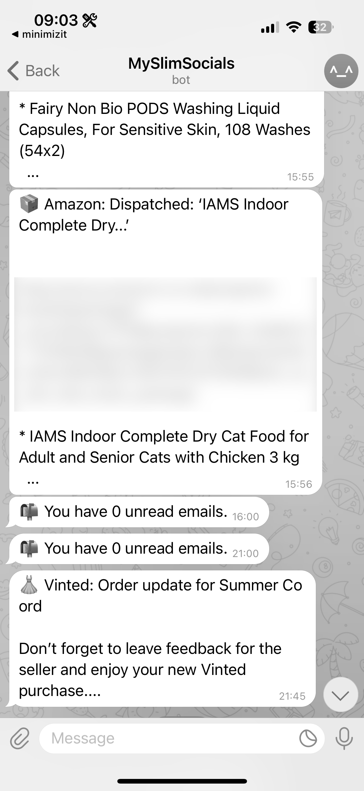

Slowly slowly...
================

Over the last few months I have been seeing more trends on people going long periods without smart phones. It started with a TikTok, where the creator went a period of time with only a "dumb phone".

It was this video that led to me really self-assessing and bringing to the forefront of my mind something I'd been pushing back: my phone is rotting my brain and TikTok is the biggest culprit. After a day or so, having had it since 2020, I deleted the app.

Now if you've never been a TikTok user you may think this fairly simple, but the first few days were difficult. In the end I had to replace TikTok with something, so I replaced it with Duolingo and grinded it like crazy.

As a nearly 30 year old, I also have to admit I did have a bit of the "fear". The fear that I would fall out of touch and no longer be hip and up to date. But you know what that was scary but it's okay.

After a while though, I no longer felt the urge to look at it and waste half an hour periodically throughout the day. This was a great first step.

I actually did try to find the TikTok again for archive reasons, but I wasn't able to access my watch history on the desktop version, and after a couple of searches I felt quite uncomfortable so I closed it down.

It was at this stage I also started using ScreenZen to try to reduce opens of different apps like Reddit, Instagram, Facebook etc.

The next trigger in my inspiration in cutting down my phone activity is this wonderful video by [Eddy Burback](https://www.youtube.com/watch?v=nnsyGSTKlw0) where he goes completely without a phone for a month. He has to get creative, put together all the tools required which are now bundled up into his smartphone. I think what this video really did for me was once again acknowledge that we all hate our phones a bit and we know it. We hate being slaves to them, but there are also other things that push back in our minds to justify why we need to do the things we do on it.

But what his video did show is that, as we all deep down know, there is merit to eliminating the portals to the entire world in our pockets.

So, I was ready, I had to get rid.

...all at once
==============

Now "getting" rid is not as simple as I hoped. Unfortunately, in this day and age, it is not really safe to be going around without a phone. And unfortunately, there are some things I genuinely do rely on, which I could replace with more analog things but this does lead to a lot of inconvenience. So instead I sat and thought about my priorities.

**Essential**

*   Basic phone functionality, the ability to call and receive messages. Due to the way society seems to be now though, this actually means a phone that supports WhatsApp
*   Maps. I can't get around comfortably without the ability to look up where I'm going, I'm very directionally challenged.
*   Google Calendar, which I already have set up to use with my partner to keep track of our commitments
*   Browser. I wanted to be able to check things in an emergency if needed
*   Facebook (sorta, not really). I only use it for societal groups I am in, but sometimes it is used to communicate last minute things I need to be aware of so I can't lose that.

**Preferable**

*   Music (if possible). I was certainly willing to get some kind of external music player if not.
*   Long form content. Used for commutes and long journeys to save me having to use a laptop.
*   Switching down to a QWERTY keyboard. This makes it feel less of a smartphone and more of a tool. Also nostalgia.

With my list of seemingly basic requirements, I went in search of a phone to suit my needs. Spoiler: there is none. Well none, that support 5G anyway. There are still a few BlackBerry's knocking around but I was dubious in returning to 4G signal, nor knowing the longevity of the phone support.

Okay, so back to the drawing board there.

Okay back to slow
=================

I spoke to my partner a bit about what I was thinking of doing, even umming and aahing about getting a smart flip phone instead as it might feel more old school. He (rightly) thought it was silly to be thinking of getting a whole new phone when I have a perfectly good one, and showed me the brand [Clicks](https://www.clicks.tech/pages/clicks-for-iphone).

Clicks are a brand of smartphone case which add an analog QWERTY keyboard to your existing phone, which is compatible with my iPhone 15.

I had seen this on my perusal of the internet but the price originally put me off a bit. But then I thought to be honest, it's cheaper than a new phone and I know how to code. So I bought the keyboard case, and got to work.

Modifying my smartphone into a "tool"
=====================================

Immediate steps I could take
----------------------------

*   Remove any apps that could encourage long term screen usage by sucking me into an endless timeline of rubbish
*   Deleted all shopping apps except Vinted and Amazon and put hard 2 access a day only blocks
*   Switched out my home screen for a minimal phone launcher
*   Made the screen really basic, and tool/stat focused. Stuck screen time right in the view!
*   Convert my phone to black and white using a focus mode
*   Turn off notifications and move essentials like Ring, Duolingo reminders to the notification scheduler

Things that were harder to remove
---------------------------------

*   All social media
*   Emails... do something about
*   Migrate as many message conversations to fewer platforms
*   Reduce notifications to the absolute bare minimum
*   Find a well-being app that caters to all my mindfulness tasks
*   Delete everything accessible online

Things I wanted to keep
-----------------------

*   Daily puzzle/education apps like NYT Games and Duolingo
*   Long form content for commuting, hidden from the home page
*   Keep Strava but turn off all notifications
*   Keep one favourite meditation app
*   Keep three calm related games
*   Keep email but design rules to filter only relevant messages
*   Keep messaging apps, migrate from Facebook Messenger to WhatsApp
*   Music and Audible

Time to CODE
============

After taking the first immediate steps I moved on to creating my "slim-socials" app which I used to run certain automated functions to assist with the things I wanted to do but struggled with right away.

Discord
-------

This was my first attempt. I set up a bot that can sit in any server I actually want to know if messages are happening and send me a message on Telegram. This allowed me to delete Discord.

Emails
------

For apps where I wanted to turn off notifications but still be informed, I:

*   Enabled all notifications to be sent via email (e.g. Facebook group posts)
*   Built an email checker to scan for keywords and forward alerts to Telegram (Facebook, LinkedIn, Vinted, Amazon, InPost)
*   Deleted Facebook and LinkedIn apps after this system was set up
*   Built a function to mark promotional emails as read and send a daily unread count

This allowed me to turn off all app notifications and streamline my alerts into one place.

Instagram
---------

This was the only app where I struggled to set up email notifications. In the end, I allowed only DM push notifications and added open/time limits using ScreenZen.

Result
======

This is now what my phone lock and home screens look like. There has been a lot of tweaking to get it exactly right, but I am very happy with how it all looks.

    

I use it with the Clicks keyboard, and though this does make the phone seem quite long, it does give that nice tactile feel I was after. It is taking time to get used to for sure, my typing is a lot slower and sometimes that puts me off using it too. But I do like it and am getting more and more used to it.

My screen time has gone down from an average of around 6-7 hours to 2-3 already, and it's funny now picking up my phone out of habit and being like "oh this is boring". I've started playing my Nintendo DS again, reading more, coding more and it's been great. Currently I am planning a 30th birthday party which does take more phone use than usual so I'm hoping this will continue to come down as well.

Conclusion
==========

It was surprisingly easy to set all of this code up. Telegram lends itself really well to bots and it's got quite a nice interface and flexibility. Gmail has an easy API to plug into and set up these email scheduler rules, as does Discord with its developer bots. All very cool!

My biggest criticism would be that most apps don’t let you access your own notifications directly—you have to rely on email configurations. This is kind of alarming!

I used a lot of boilerplate and online code to build these, so I haven't published this one as a project, but please contact if you're interested.

All in all, I am happy to be taking back control on my time, and being less of a slave to it.