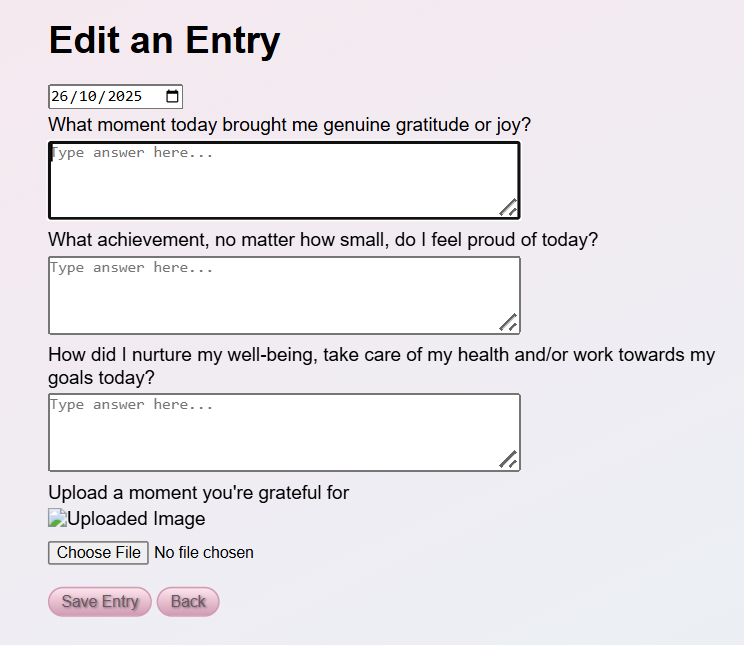
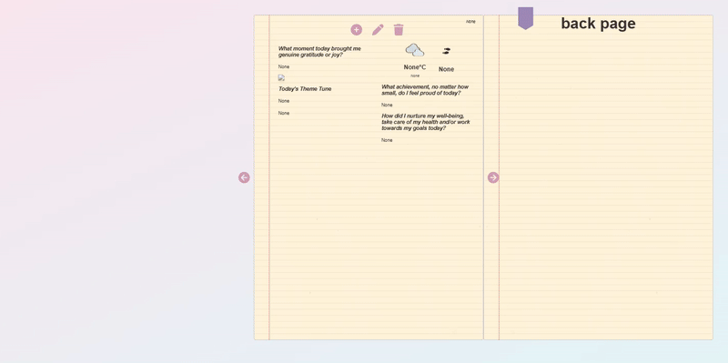
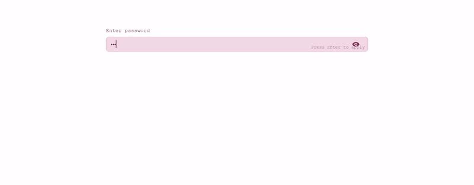
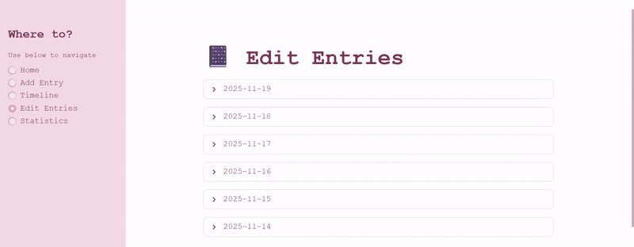
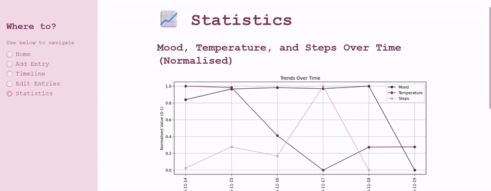

In the last year or two I've been struggling (again) and trying to find ways to take better care of myself. As a result I started taking lots of steps to try and improve my mental health and wellbeing. Some of this has been through trying out new hobbies, changing up my lifestyle, reducing my phone addition and more. I picked up meditation and really got into these gratitude apps. Gratitude journalling. I found it really nice to have a daily ritual of adding something each day to a little phone app and reflecting on the things, however small, I could be grateful for. Sometimes I struggle to remember if there is anything at all. 

What I was NOT grateful for was the cost of the little phone app.

For the freedom of customisation and editing and all sorts of other features, my free trial was over and they were looking to charge something like £70 a annually. This was not something I could justify, but the free version felt so restrictive.

You can see where this is going...

So I thought to myself, hey it really is just a database with a front end. I can make that, easy.
This blog details the process of building my own journal app, and the lessons learned along the way!

Original
================
I first started this project back in April 2025, with the anticipation this would be a much shorter project than my Ultimate Flaggle project. It was around this time I began taking lots of steps to improve my health, such as the slim-socials project (see [Slim Socials](blogs/20250422_slim_socials.html)) and also my weight loss journey. However, this definitely became a massive time sink very quickly.

My original concept was that I wanted it to look and feel like an actual notebook. I wanted each entry to have a page and then not just be the journal entry but have lots of different pieces of information about the day integrated on the page, such as steps and weather.

I put together the following specification
- Password protected
- Three gratitude questions that could be increased/decreased depending on what I wanted as time wore on
- The ability to upload a picture to the entry (optional)
- The entry to capture my total steps for the day, weather, most listening to song / genre and analyse the mood of my entry.
- Have a home page with various graphs and analysis of my entries
- Have the journal send a message to my slim-socials if I hadn't filled it in for the day
- Look like a book and be able to flip through "pages" for each entry

Worked on this project for several months and eventually managed to put together this:

I made it so as the pages turned, the book would centre the entry in the middle of the screen so it would be easily compatible with mobile. I spent a long time perfecting the CSS to make it look like a book, and try to visual the best way to make the entry pages feel organic. When adding entries, the interface was simple and flexible. 

However there was one little problem...

Yeah I could flip through the book left to right, but when trying to go back it really didn't want to know. I tried many many many variations of the javascript page turning logic, to try to get the pages to dynamically stack on top of each other and then dynamically figure out which one to be looking at and hide / display depending.

I pushed on with other areas but that was getting complicated too. The Spotify API integration wasn't giving me what I had envisioned. If I requested the most played song and the genre it could only give me the genres for the artist of the most played songs which meant I didn't have the genre of the song itself. Difficult if artists work in multiple genres. And every time I wanted to change anything it seemed to break another five things. Not to mention trying to upload everything to be live and accessible via the internet.

I was close for a really long time. And every time I loaded up the code I started to hate it even more. I just wanted to be able to use it. I'd gone months without journalling thinking it would be finished soon, finished soon. I would open it, mess with the code, it not work and still have tons of things I needed to sort / add to it.

So I made a very big decision...

Starting Again
================

Back to the drawing board. For starters, I'm not a front end coder at heart, I don't really enjoy it. And I can design to a reasonable extent, but making things beautiful takes a long time for me to craft. But I had heard of Python packages for building apps more easily and I quickly came across [streamlit](https://streamlit.io/). The splash on their website reads "Turn your data scripts into shareable web apps in minutes. All in pure Python. No front‑end experience required."

Yep that sounds pretty spicy.

Now there were a few limitations I needed to adapt to. Previously I had just used an inbuilt SQLite database for my apps as it was all I needed. But streamlit does not allow you to persist changes to files within your github repository. So I had to migrate my database design to [Supabase](https://supabase.com/), which was surprisingly easy (I spent more time trying to figure if there was a way I could avoid it rather than actually doing it). Which, speaking of, I massively simplified the database design. It didn't need to be as fancy as I was trying to make it. Also hosting the database on the cloud meant it was far easier for me to set up an API endpoint for me to store my steps in the database. I managed to use the Health App and Shortcuts on my phone to take my steps data everyday close to midnight and store it in my database. Being able to find ways to do things automatically is so super cool.

Finally, I dropped parts of my specification. Spotify was a goodbye and I was going to go for a much simpler front end, taken care of by streamlit. I changed it so it would only be able to have one entry per day, and I made the entry one prompt instead of multiple questions. 

And voila! Within 2 weeks, I had migrated all of my existing back end code to the right formats and built a simple clean front end. Check it out!

This shows the password, home page with word cloud, adding a new entry to my journal and viewing the entry on the timeline. 

Editing entries was also easy to set up and intuitive to use.

Finally I incorporated some statistical graphs to a final page.

The app has been up and running for a few days and I've put in an entry every day and I can already feel some of that joy coming back. It runs smooth and I can easily use it on both my computer and phone.

Outstanding Issues
================

In future I would love to add more statistics and graphs, perhaps different "daily metadata" that can either automated from my phone or other APIs. I also have other ideas for features that can be added in later, while I am still able to use my journal now.

For the app itself, it runs really well. The only adjustments I want to make are to count early morning entries as an entry for yesterday or at least be able to put in for yesterday (so I don't have to keep chasing midnight to get my daily entry in!). The sentiment and mood analysis for the entries as well is likely not the best approach as it just says I'm elated and very positive every day, which makes sense for a gratitude journal but means I'm not quite sure what I will get out of it.

Other than that though, I love it and I'm really pleased with how it came out. In the end I was able to host it entirely free.

Reflections
================

With this project, I started out with a similar mindset to Flaggle, that I must create the "ultimate" thing. But really what I needed was simple - and it made more sense to start small and build it up over time. 