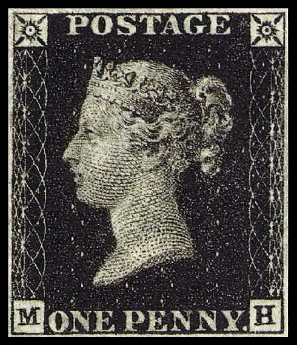
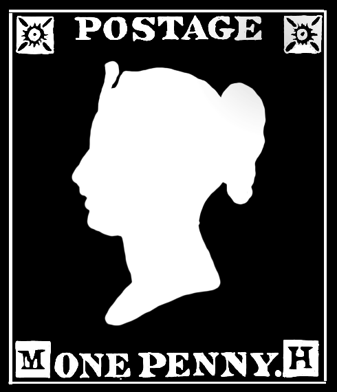
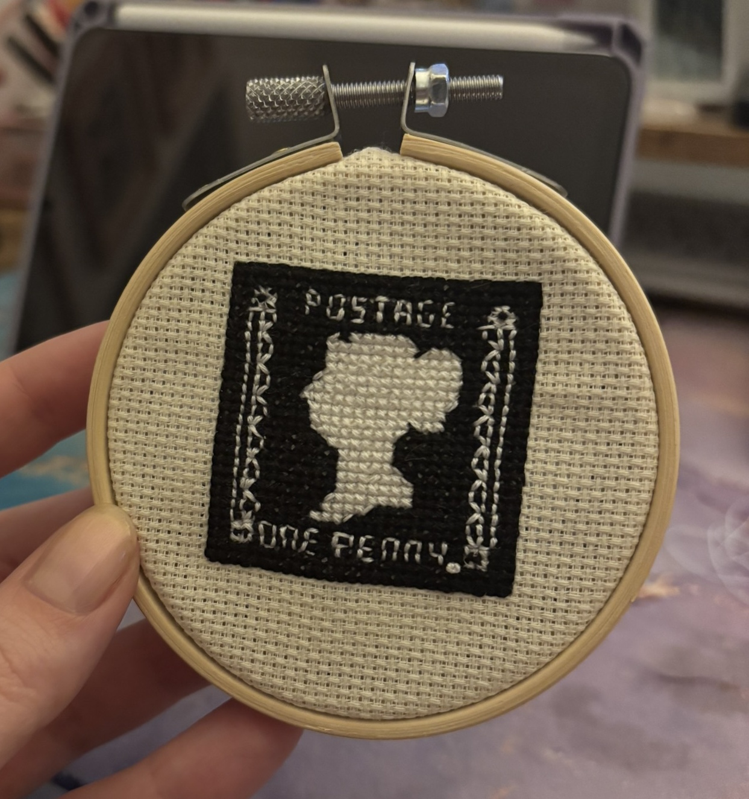
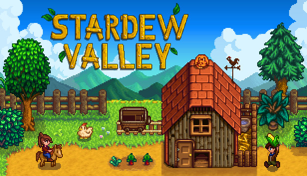
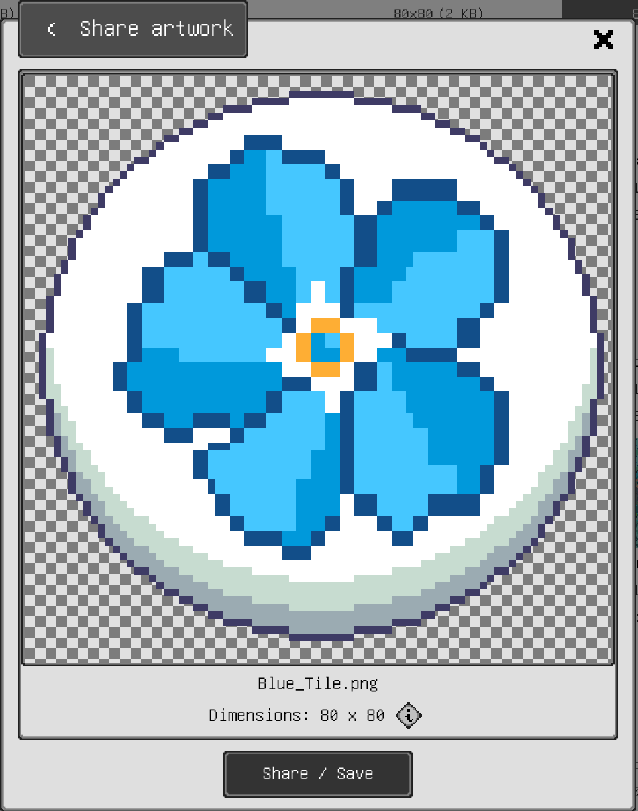
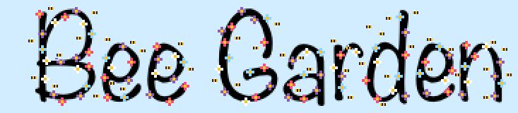
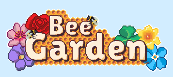

## Background

A little while ago in my quest to my phone usage, I got an iPad Mini. Sounds counter intuitive, but bear with me. By moving my apps and distractions to the iPad and blocking them on my phone it gave me extra friction to really think. This allows me to consider do I really want to do the thing and go to the effort of getting the iPad instead or was I just opening it out of habit.

What this also unlocked for me was the ability to use a pen stylus for writing and drawing. Back in 2025 I wanted cross stitch a penny black stamp for my partner’s dad for Christmas. A pattern for this didn’t exist, so I used my iPad to trace out a relief image of the stamp and then used an app to create a cross-stitch pattern. The Christmas present was a hit, but I also discovered a new mindfulness activity – making cross stitch patterns.

I’ve since made a few more patterns (which I shall keep a secret as they are also gifts) but I started to make a few extra patterns to experiment with possibly creating patterns to sell online. This started with a series of mini flowers, originally intended to do a mini flower pattern for each birth month flower (which I may still do). But this did end up sending me on a slightly different path.

INSERT IMAGE OF FLOWER PATTERNS (ORIGINAL)

For those not familiar, essentially to make a cross stitch pattern you take an image and then render the image using tiny squares which make each stitch you eventually sew. However, this is also an art form in itself called pixel art. You may have seen the pixel art of my avatar on this website in fact! Whereas before I painstakingly created that on an online app with my mouse, I am now able to draw using my iPad. I can create a pixel art image and easily convert it into a cross-stitch pattern. I found though, since cross stitch takes quite a long time, I could make many patterns that I would likely never have the time to cross stitch and yet I really was enjoying the drawing. Hold that thought for now…

For the last few years, myself and a friend had kept talking about making a game together. It was something I had been curious about for a long time, particularly after completing my Masters degree and getting massively into [Stardew Valley](https://store.steampowered.com/app/413150/Stardew_Valley/) over the pandemic.

Stardew Valley is a pixel art indie game originally created by one creator over four years. Very inspiring! It is also an excellent game so I would recommend you play it. We had been umming and aahing but had no ideas. I did, however, recently what [this video](https://www.youtube.com/watch?v=OFmfT5Pb1hA) by Cute Games Club, which recommended to get into game development the first step is to make lots of tiny games with specific mechanics so you can learn how they work.

## Designing a Game

Consequently, in the new year I challenged my friend to make a mini game and I will too by the end of March. This was to keep up accountable and kick us out of our procrastination. Now with all the art I was doing and a new goal in mind, I turned my attention to developing my little game.
Now I’m not entirely new to “game” development, having created [Ultimate Flaggle](https://www.ultimateflaggle.co.uk/) last year. But this was my first exploration to game building using a proper game engine. I chose to use Godot as it’s an accessible open-source option with plenty of online tutorials and help.
I wanted to make a match three game, to learn how to programme a matrix within a game and also because they’re my favourite kind of puzzle games. I quickly decided to make my favourite kind of match three game, with the following criteria:

* Match Three puzzle game
* Be cute (duh)
* Infinite game that naturally increases difficulty (ie, no levels just keep playing)
* A way to lose (to end the infinite game)
* Make all the art and music myself
* Has a top score you can beat

Since I had already been drawing flowers and they fit the “be cute” criteria I started brain storming theme ideas and soon came up with Bee Garden. I listed all the assets I needed to create the game and got started. I converted my flower drawings to create tiles and drew all the assets to be included in the game. I recorded lots of sounds around my home to make the sound effects too.

The main title sequence was also a part I was particularly proud of, there was an initial placeholder and a reworked final version.

*Original Design*

*Final Design*

The overall game was then designed with the following rules:

* Match three or more flower tiles vertically or horizontally to score points
* When matching in a T or L formation of 5 or more, this produces a honey comb tile which can be later swapped to delete a whole row or column (or both if you swap two honey combs)
* When matching 5 or more tiles in a row, this produces a honey glob time which can be swapped with a coloured flower tile to delete all tiles of that colour (or all tiles on the board if you swap two honey globs).
* As you match the board will refill with more flower tiles
* If you match next to a bee tile (i.e. a move you do ends up in a gap next to a bee), this will reduce by one bee until there are no bees left and it disappears
* If you make a match and it is not next to a bee tile, a new bee tile will generate
* You cannot match bees
* As the game continues, bee spawning increases
* You lose the game by running out of moves

## Creating the Game

I used [this tutorial](https://www.youtube.com/watch?v=YhykrMFHOV4&list=PL4vbr3u7UKWqwQlvwvgNcgDL1p_3hcNn2) to get me started with the fundamentals of creating a 2D matrix game in Godot, but quickly moved on from it to develop it into my own game. Also a warning if you are to use this, it is a little out of date syntactically if you use the latest version of Godot.

I've found that coding a video game requires a lot of maths, algorithm design and problem solving. Each thing seems deceptively simple. I really respect the amount of time and effort that must go into massive games!

## Sounds

I recorded some of my own audio (primarily the game piece sounds) and then used royalty free music and sound effects from Pixabay. Credits below:

Background Music by [Geoff Harvey](https://pixabay.com/users/geoffharvey-9096471/?utm_source=link-attribution&utm_medium=referral&utm_campaign=music&utm_content=150622) from [Pixabay](https://pixabay.com/?utm_source=link-attribution&utm_medium=referral&utm_campaign=music&utm_content=150622)

Bee and garden sounds overlaid into background music by [Mikhail](https://pixabay.com/users/soundsforyou-4861230/?utm_source=link-attribution&utm_medium=referral&utm_campaign=music&utm_content=156704) from [Pixabay](https://pixabay.com/?utm_source=link-attribution&utm_medium=referral&utm_campaign=music&utm_content=156704)

Bee Sound Effect by [Delon_Boomkin](https://pixabay.com/users/delon_boomkin-32986949/?utm_source=link-attribution&utm_medium=referral&utm_campaign=music&utm_content=374021) from [Pixabay](https://pixabay.com/sound-effects/?utm_source=link-attribution&utm_medium=referral&utm_campaign=music&utm_content=374021)

Honey Sound Effect by [Benjamin Adams](https://pixabay.com/users/benkirb-8692052/?utm_source=link-attribution&utm_medium=referral&utm_campaign=music&utm_content=268901) from [Pixabay](https://pixabay.com/sound-effects/?utm_source=link-attribution&utm_medium=referral&utm_campaign=music&utm_content=268901)

Comb Sound Effect by [FoxBoyTails](https://pixabay.com/users/foxboytails-49447089/?utm_source=link-attribution&utm_medium=referral&utm_campaign=music&utm_content=317318) from [Pixabay](https://pixabay.com/sound-effects/?utm_source=link-attribution&utm_medium=referral&utm_campaign=music&utm_content=317318)

Swap Back Sound Effect by [FreeSounds-4U](https://pixabay.com/users/freesounds-4u-51979242/?utm_source=link-attribution&utm_medium=referral&utm_campaign=music&utm_content=401152) from [Pixabay](https://pixabay.com/?utm_source=link-attribution&utm_medium=referral&utm_campaign=music&utm_content=401152)

All other sound effected were recorded and created by me.

## Game Demonstration

Below is a short video demonstrating the game in action.

  <iframe 
    src="https://www.youtube.com/embed/AZUBzeWLgyA"
    title="YouTube video"
    frameborder="0"
    allow="accelerometer; autoplay; clipboard-write; encrypted-media; gyroscope; picture-in-picture"
    allowfullscreen>
  </iframe>

## Testing

I would love for you to test and feedback on my game! Please download it below to play and fill in the feedback form with any ideas, bugs or suggestions.

[Download Bee Garden for Windows Desktop](https://drive.google.com/uc?export=download&id=1OIbDamsLvwVRkiLMBVA8h4egU7kw02Ft)

## Conclusion

This was such a fun little project to get me off the ground with game development! Over time I think I will keep adding to this little game to keep building up my skills, but I would also like to try others. My goal is to convert [Ultimate Flaggle](https://www.ultimateflaggle.co.uk/) to a game using this engine I can later convert into an app in the app store. I’ve very proud of the progress I made with it, both from a technical and art point of view – not to mention I have a cute little match three game made just for me!